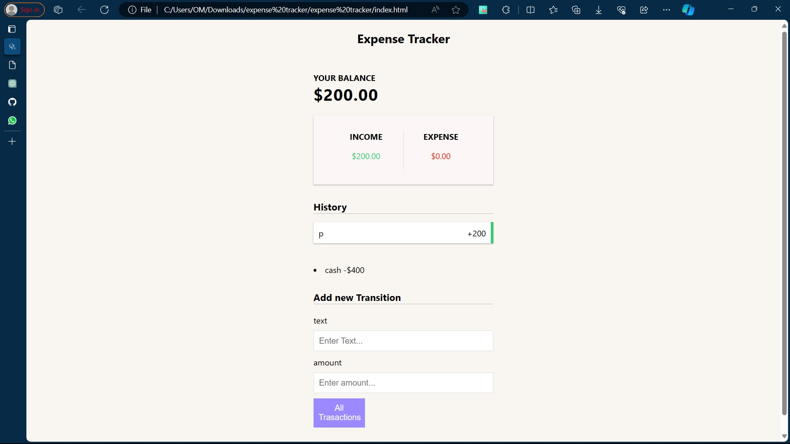

# Expense Tracker

A simple expense tracker built using JavaScript.
 
Project Link - [Expence Tracker.](https://expense-trackeron.netlify.app/)

## Table of Contents

- [Introduction](#introduction)
- [Features](#features)
- [Installation](#installation)
- [Usage](#usage)
- [Technologies Used](#technologies-used)
- [File Structure](#file-structure)
- [Dependencies](#dependencies)
- [Code Overview](#code-overview)
- [Example](#example)
- [Future Improvements](#future-improvements)
- [Troubleshooting](#troubleshooting)
- [Resources](#resources)
- [License](#license)

## Introduction

Expense Tracker is a web application designed to help users keep track of their expenses. It allows users to add, edit, and delete expenses, providing a simple and intuitive interface for managing their finances.

## Features

- Add new expenses with details such as date, category, and amount.
- Edit existing expenses to update information.
- Delete expenses that are no longer needed.
- View a summary of total expenses.
- Responsive design for use on various devices.

## Installation

To run the Expense Tracker locally, follow these steps:

1. Clone the repository: https://github.com/gaikwadomg/expense-tracker.git

2. Navigate to the project directory:

3. Open the `index.html` file in your web browser.

## Usage

- Click the "Add Expense" button to add a new expense.
- Fill in the details such as date, category, and amount.
- Click "Save" to add the expense to the list.
- Use the edit and delete buttons to manage expenses.

## Technologies Used

- JavaScript
- HTML
- CSS

## File Structure

- `index.html`: Main HTML file for the expense tracker.
- `style.css`: CSS file for styling the interface.
- `script.js`: JavaScript file containing the application logic.

## Dependencies

- None

## Code Overview

The JavaScript code handles the interactions with the user interface and manages the expense data.

## Example

Image 

## Future Improvements

- Add support for multiple users/accounts.
- Implement data persistence using local storage or a backend database.
- Enhance the user interface with charts and graphs for visualizing expenses.

## Troubleshooting

If you encounter any issues while running the Expense Tracker, try the following:

- Ensure that your web browser is up to date.
- Check the browser console for any error messages.
- Verify that all files are properly linked and accessible.

## Resources

- [MDN Web Docs](https://developer.mozilla.org/en-US/docs/Web) - Documentation for web technologies.
- [Stack Overflow](https://stackoverflow.com/) - Community-driven question and answer site for programming.

## License

This project is licensed under the MIT License - see the [LICENSE](LICENSE) file for details.

